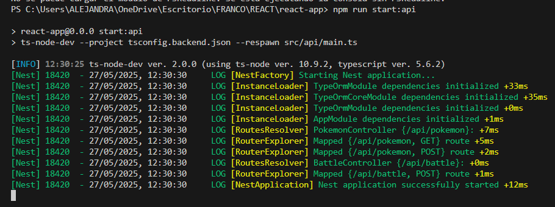
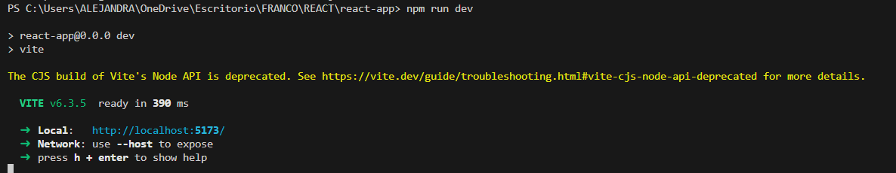

# Challenge Pokémon

## Estructura del Proyecto

### Carpeta `api`

Aquí se encuentra la lógica del backend y la gestión de la base de datos del proyecto.

- Cada entidad está representada por una tabla en la base de datos.
- El servicio `BattleService` gestiona las batallas.

### Carpeta `components`

Contiene los componentes de la aplicación.

- Cada componente representa una funcionalidad específica:
  - **FetchPokemon**: Muestra una lista de Pokémon (cargados desde `pokemon.json`) como botones con imágenes.
  - **ShowFighters**: Muestra los Pokémon seleccionados para la batalla.

---

## Cómo ejecutar el proyecto

1. Abrir dos terminales.
2. En la **primera terminal**, ejecutar:
   ```
   npm run dev
   ```
   Esto inicia el servidor de desarrollo de la API. Acceder al enlace generado en la consola.
3. En la **segunda terminal**, ejecutar:
   ```
   npm run start:api
   ```
   Esto inicia la API REST, que maneja la lógica del juego y la base de datos.

Ejemplo de ejecución:




---

## Base de Datos

- Se generará una carpeta llamada `pokemon.db`.
- La base de datos se inicializa con dos tablas: `pokemon` y `battles`.
  - **pokemon**: Contiene los datos de los Pokémon (nombre, tipo, vida, ataque y defensa), leídos desde el archivo `pokemon.json`.
  - **battles**: Almacena los datos de las batallas realizadas.
- Para visualizar el contenido de la base de datos, se recomienda utilizar la extensión **SQLite Viewer**.

---
